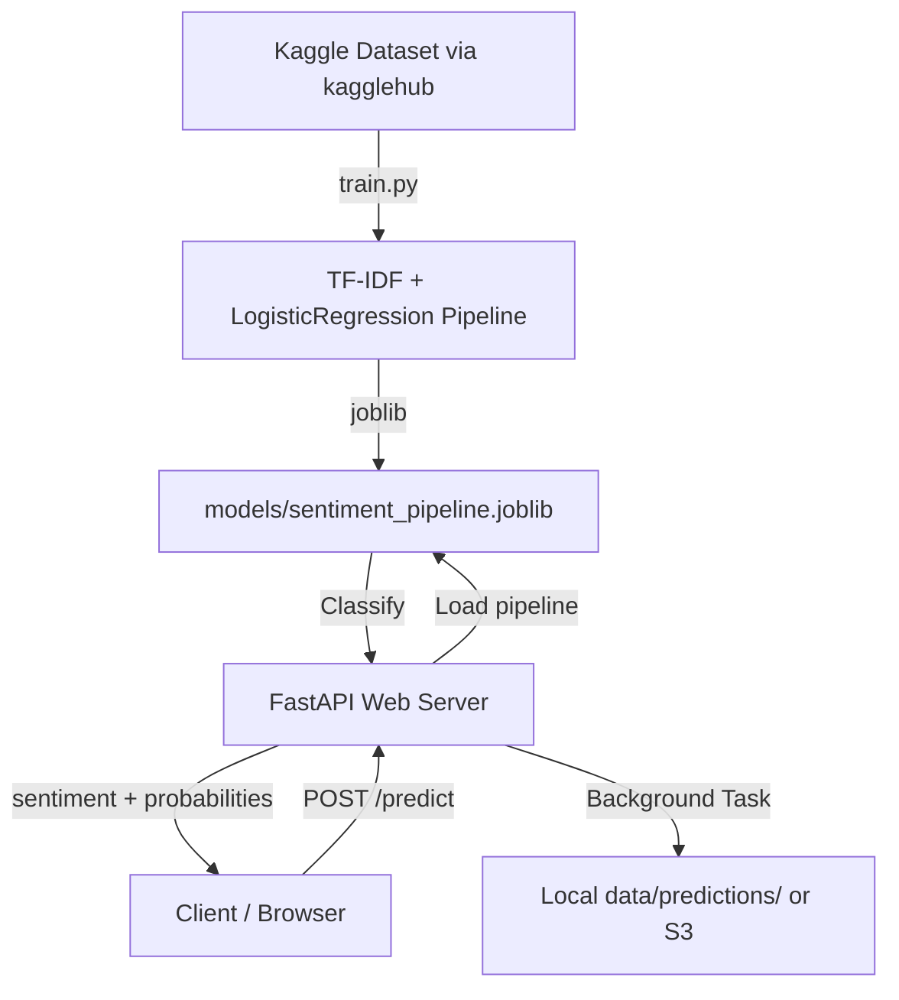

# Sentiment Analysis & Review Intelligence API

A production-grade, containerized MLOps API that trains a **TF-IDF + Logistic Regression** classifier on a real Twitter sentiment dataset sourced from Kaggle and serves multi-class predictions via FastAPI.

## Features

- **Real Kaggle Dataset:** Downloads `abhi8923shriv/sentiment-analysis-dataset` via `kagglehub` — no manual CSV download needed.
- **Lightweight Training:** Trains a Scikit-Learn TF-IDF + Logistic Regression pipeline in under 10 seconds on CPU.
- **Multi-Class Prediction:** Classifies text as `positive`, `negative`, or `neutral` with confidence probabilities.
- **FastAPI Backend:** Auto-generated Swagger UI at `/docs`.
- **Async Logging:** Review inputs and predictions are saved to S3 (or local fallback) via background tasks.
- **Docker Ready:** Runs dataset download and model training at image build-time.

---

## Project Architecture



---

## Folder Structure

```text
sentiment-analysis/
│
├── app/
│   ├── __init__.py
│   ├── config.py        # Model paths and AWS settings
│   ├── main.py          # FastAPI routes and lifespan
│   ├── model.py         # Pipeline loader and predictor
│   ├── schemas.py       # Pydantic request/response models
│   └── utils.py         # S3 and local storage logging
│
├── src/
│   └── train.py         # Downloads Kaggle data and trains the model
│
├── models/              # Trained joblib artifacts and metrics.json
├── data/predictions/    # Local prediction log files
├── tests/
│   └── test_main.py     # Mocked unit tests for all endpoints
│
├── Dockerfile
├── requirements.txt
├── model_card.md
└── .gitignore
```

---

## Installation & Setup

### 1. Create Environment
```bash
python -m venv venv

# Windows:
venv\Scripts\activate
# Linux/macOS:
source venv/bin/activate

pip install -r requirements.txt
```

### 2. Train the Model
This will download the Kaggle dataset and train the TF-IDF classifier:
```bash
python src/train.py
```
Outputs saved to `models/sentiment_pipeline.joblib` and `models/metrics.json`.

### 3. Run the API
```bash
python -m uvicorn app.main:app --reload
```
API available at `http://localhost:8000`. Swagger docs at `http://localhost:8000/docs`.

---

## API Endpoints

| Method | Endpoint | Description |
|---|---|---|
| **GET** | `/` | Health check |
| **POST** | `/predict` | Predict sentiment for a single review |
| **POST** | `/batch_predict` | Predict sentiment for multiple reviews |
| **GET** | `/model` | Return model name and training metrics |
| **GET** | `/docs` | Swagger interactive UI |

### Example: Single Prediction
**Request:**
```bash
curl -X POST http://localhost:8000/predict \
     -H "Content-Type: application/json" \
     -d '{"text": "The movie was absolutely fantastic!"}'
```
**Response:**
```json
{
  "text": "The movie was absolutely fantastic!",
  "sentiment_prediction": "positive",
  "probabilities": {
    "negative": 0.0034,
    "neutral":  0.0421,
    "positive": 0.9545
  },
  "latency_ms": 3.21,
  "timestamp": "2026-07-11T09:49:00.000000+00:00"
}
```

### Example: Batch Prediction
**Request:**
```bash
curl -X POST http://localhost:8000/batch_predict \
     -H "Content-Type: application/json" \
     -d '{"texts": ["I loved it!", "Absolutely terrible.", "It was okay."]}'
```

---

## Docker

```bash
# Build (downloads dataset and trains model inside the image)
docker build -t sentiment-api .

# Run
docker run -p 8000:8000 sentiment-api
```

---

## AWS Elastic Beanstalk Deployment

```bash
pip install awsebcli
eb init -p docker sentiment-api-service
eb create sentiment-env
eb deploy
```

---

## Testing

```bash
python -m pytest -v tests/
```
